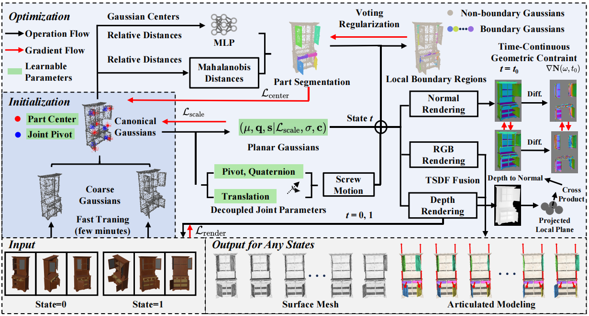

<div align="center">

# **REArtGS++**: Generalizable Articulation Reconstruction with Temporal Geometry Constraint via Planar Gaussian Splatting
# CVPR 2026

<div align="center" margin-bottom="6em">
    <span class="author-block">
        Di Wu</a><sup>1,2,4</sup>,</span>
    <span class="author-block">
        Liu Liu</a><sup>3,*</sup>,</span>
    <span class="author-block">
        Anran Huang</a><sup>3</sup>,</span>
    <span class="author-block">
        Yuyan Liu</a><sup>3</sup>,</span>
    <span class="author-block">
        Qiaojun Yu</a><sup>5</sup>,</span>
    <span class="author-block">
        Liu Shaofan</a><sup>3</sup></span>
    <span class="author-block">
        Liangtu Song</a><sup>1</sup></span>
    <span class="author-block">
        Cewu Lu</a><sup>5</sup></span>
    <br>
    <p style="font-size: 0.9em; padding: 0.5em 0;">✶ indicates corresponding author</p>
    <span class="author-block">
        <sup>1</sup>Hefei Institutes of Physical Science, Chinese Academy of Sciences<br>
        <sup>2</sup>University of Science and Technology of China<br>
        <sup>3</sup>Hefei University of Technology<br>
        <sup>4</sup>RoboticsX, Tencent<br>
        <sup>5</sup>Shanghai Jiao Tong University<br>
    </span>

[Website](https://sites.google.com/view/reartgs2/home/) | [Arxiv](https://arxiv.org/pdf/2511.17059)
</div>
</div>

<div align="center">
  
</div>

## Data Preparation
Following ArtGS (https://github.com/YuLiu-LY/ArtGS.git), please download the data from [HuggingFace](https://huggingface.co/datasets/YuLiu/ArtGS-Dataset).

## Environment Setup
You can create a conda environment and install the packages as follows: 
```bash
git clone https://github.com/wd-ustc-cs/REArtGS2.git
cd REArtGS2

conda create -n artgs python=3.10
conda activate artgs
conda install pytorch==2.4.1 torchvision==0.19.1 torchaudio==2.4.1 pytorch-cuda=12.1 -c pytorch -c nvidia
pip install -r requirements.txt

# install pytorch3d and tiny-cuda-nn
pip install git+https://github.com/facebookresearch/pytorch3d.git
pip install git+https://github.com/NVlabs/tiny-cuda-nn/#subdirectory=bindings/torch

# build pointnet_lib for nearest farthest point sampling
cd utils/pointnet_lib
python setup.py install
cd ../..

# ag_diff_gaussian_rasterization is used for fast visualization, and diff-plane-rasterization is used for planar Gaussian rendering
pip install ./submodules/ag_diff_gaussian_rasterization
pip install ./submodules/diff-plane-rasterization

# simple-knn
pip install ./submodules/simple-knn
```

## Training
Fisrt, conduct a fast initialization:
```bash
python train_coarse.py --dataset {dataset} --subset {subset} --scene_name {scene_name} --model_path outputs/{dataset}/{subset}/{scene_name}/coarse_gs --resolution 2 --iterations 10000 --opacity_reg_weight 0.1 --random_bg_color
# For example, dataset=artgs, subset=sapien, scene_name=storage_45503 
```
Then, perform training for planar Gaussians:
```bash
python train_gui.py --dataset {dataset} --subset {subset} --scene_name {scene_name} --model_path outputs/{dataset}/{subset}/{scene_name}/art_gs --eval --resolution 1 --iterations 30000 --seed 0   --coarse_name coarse_gs --random_bg_color --densify_grad_threshold 0.001
```

## Extract Mesh
```bash
python planar_render.py --dataset {dataset} --subset {subset} --scene_name {scene_name} --model_path outputs/{dataset}/{subset}/{scene_name}/art_gs --resolution -1 --iteration 30000 --render_mesh_seg --skip_test
```
We also provide ``mesh_viewer.py``, ``render_video.py`` and ``mesh_generation.py`` for mesh visualization, rendering videos and generate meshes at unseen states respectively.

## Prepare Your Own Real-World Data
Please prepare two-stage observations and use Colmap to estimate the camera pose for these images. Then you should use ``scripts/colmap_process.py`` to normalize the sparse point clouds.

Similar to Artgs (https://github.com/YuLiu-LY/ArtGS.git), following tricks are useful for reconstructing self-captured real-world objects.

**Manually Correcting the Centers.**
You can manually correct the centers of parts by visualizing the initialized canonical Gaussians and centers in ``vis_utils/vis_init_cano.ipynb``.

**Using Depth or Monocular Depth for Training.**
Use RGB-D or monocular depth estimated by [DepthAnythingV2](https://github.com/DepthAnything/Depth-Anything-V2) to train the model.


## Citation
If you find our paper and/or code helpful, please consider citing:
```
@article{wu2025reartgs++,
  title={REArtGS++: Generalizable Articulation Reconstruction with Temporal Geometry Constraint via Planar Gaussian Splatting},
  author={Wu, Di and Liu, Liu and Huang, Anran and Liu, Yuyan and Yu, Qiaojun and Liu, Shaofan and Song, Liangtu and Lu, Cewu},
  journal={arXiv preprint arXiv:2511.17059},
  year={2025}
}
```

## Acknowledgement
This code heavily used resources from [ArtGS](https://github.com/YuLiu-LY/ArtGS.git), [PGSR](https://github.com/zju3dv/PGSR.git), [REArtGS](https://github.com/wd-ustc-cs/REArtGS.git). We thank the authors for their awesome projects.

